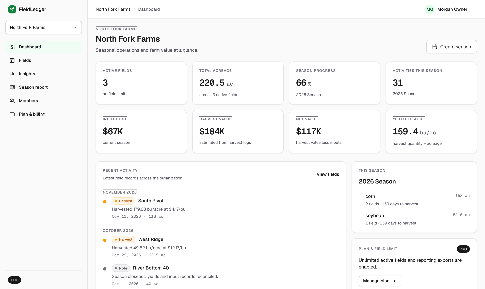
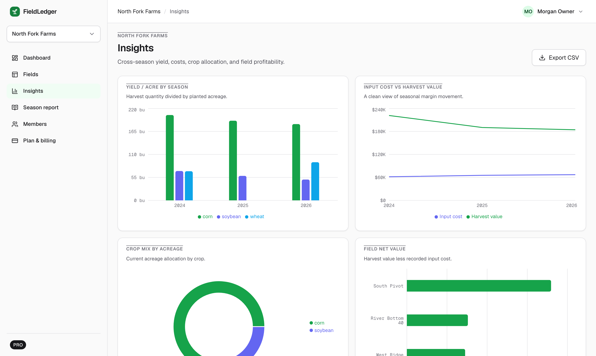
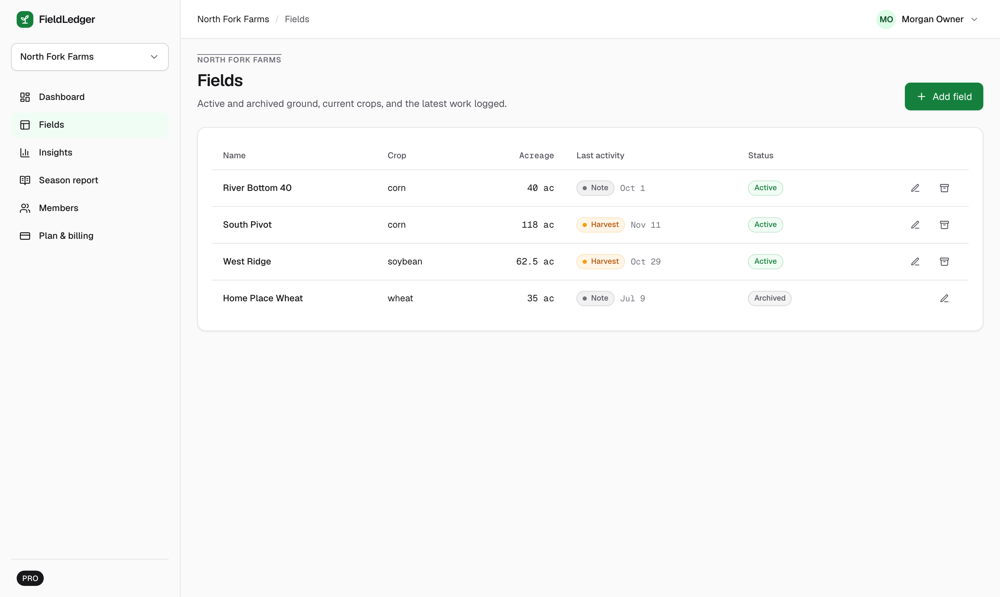

# FieldLedger

**A multi-tenant farm operations SaaS you can run, break, and audit in two minutes — no accounts, no API keys, no external services.**

[](https://github.com/scottdev1986/FieldLedger/actions/workflows/ci.yml)



I build agricultural operations reporting professionally; that work is private. FieldLedger is the public counterpart — a complete, production-shaped SaaS built to be inspected: organizations, roles, plan gating, cross-season analytics, and PostgreSQL row-level security enforced *behind* a C# API, not instead of one.

## Run it

```bash
docker compose up --build
docker compose run --rm seeder
```

Open http://localhost:3000 — that's the whole setup. Every credential and secret has a working local default; nothing external is called, ever.

| Demo account | Email | Password |
|---|---|---|
| Owner | `owner@fieldledger.demo` | `FieldLedgerDemo!2026` |
| Agronomist | `agronomist@fieldledger.demo` | `FieldLedgerDemo!2026` |
| Viewer | `viewer@fieldledger.demo` | `FieldLedgerDemo!2026` |

Try this: sign in as the owner, upgrade the org to Pro (instant, audited, honestly labeled — no payment is simulated as real), watch the season report and CSV export unlock, then sign in as the viewer and notice that every edit control is gone. Then try the writes anyway with `curl` — the API refuses them, and if the API ever forgot to, the database would.

<table>
  <tr>
    <td></td>
    <td></td>
  </tr>
  <tr>
    <td align="center"><em>Cross-season insights</em></td>
    <td align="center"><em>Fields &amp; activity records</em></td>
  </tr>
</table>

## The interesting part: RLS behind the API

Most stacks pick one authorization boundary. FieldLedger deliberately has two:

1. **The API** (ASP.NET Core, .NET 10) authenticates users with first-party JWTs it issues itself, checks roles and plan entitlements in every handler, and returns clean, typed errors.
2. **The database** (PostgreSQL 17) enforces the same rules again with forced row-level security. Every request runs inside a transaction that carries the verified user id:

```sql
begin;
set local role authenticated;
select set_config('app.user_id', '<verified JWT sub>', true);
-- application SQL — policies check membership + role per row
commit;
```

The API's database role has **no `BYPASSRLS`**. A buggy handler cannot leak another tenant's rows, because the database never shows them. Sensitive paths are narrower still: `users.password_hash` isn't selectable by the app role at all (login goes through a dedicated `security definer` function), and plan entitlements can only change through an owner-checked, audited function — `authenticated` has no write grants on those tables.

Prove it yourself — the assertion suite covers tenant isolation, viewer write denial, owner-only plan changes, entitlement write protection, and the Free-plan field-limit trigger:

```bash
docker compose exec -T db psql -U postgres -d fieldledger -v ON_ERROR_STOP=1 -f - < db/rls/rls-checks.sql
```

## What's inside

| Concern | Implementation |
|---|---|
| Frontend | Next.js 16, React 19, Tailwind v4, TanStack Query, Recharts — role- and plan-aware UI |
| API | ASP.NET Core minimal APIs, Npgsql with hand-written SQL, transaction-scoped RLS context |
| Auth | First-party: PBKDF2 password hashes, API-issued HS256 JWTs, exact-expiry validation |
| Tenancy | Orgs → members (owner / agronomist / viewer) → fields → seasons → activities |
| Plans | Free (3 fields) vs Pro (unlimited + CSV export + season report); in-app owner-only upgrade with a `plan_changes` audit trail and a documented seam where a real payment provider would plug in |
| Data | Deterministic C# seeder — 3 users, 2 orgs, 3 seasons, 143 crop-calendar activities, identical on every run |
| Migrations | Plain SQL applied by a C# runner (advisory lock + `schema_migrations`) via a one-shot compose service |
| Tests | xunit unit + live-database integration tests (RLS matrix, entitlement gates, auth), web typecheck/lint/build |
| CI | GitHub Actions: full test suite and the RLS assertion suite against a Postgres 17 service container on every push |

## Design docs

The design is maintained as a linked wiki with ADRs, diagrams, and a change log — written before the code and kept in sync with it: **[docs/fieldledger-design-wiki](docs/fieldledger-design-wiki/index.md)**. Start with [ADR 0006](docs/fieldledger-design-wiki/adr/0006-self-contained-postgres-first-party-auth.md) (why self-contained Postgres + first-party auth) and [ADR 0007](docs/fieldledger-design-wiki/adr/0007-in-app-plan-management-no-external-billing.md) (why plan gating without a payment provider). The frontend follows a written design system: [docs/frontend-design-brief.md](docs/frontend-design-brief.md); the API implements a written contract: [docs/api-contract.md](docs/api-contract.md).

## Repository layout

```text
apps/
  web/        Next.js frontend
  api/        ASP.NET Core API
  api.Tests/  xunit unit + live-database integration tests
  seeder/     .NET console app: `migrate` and `seed`
db/
  init/       role bootstrap (docker-entrypoint-initdb.d)
  migrations/ ordered SQL migrations (schema, functions, RLS)
  rls/        RLS assertion suite
docs/
  fieldledger-design-wiki/   design wiki + ADRs
```

## Honest limitations

- Demo secrets and passwords are baked into `docker-compose.yml` defaults on purpose — this is a local, self-contained demo. Rotate everything before any real deployment (an untracked `.env` overrides any variable).
- Browser JWTs live in `localStorage`; the wiki documents the httpOnly-cookie BFF alternative a production build would use.
- Plan changes are real entitlement changes but no money moves anywhere, and the UI says so on the page.
