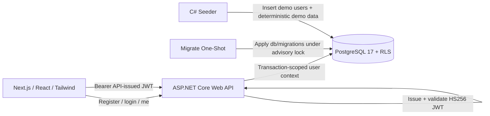

# FieldLedger Technical Design Document


**Compiled from the FieldLedger design wiki.**


Generated: 2026-07-09


---


# FieldLedger Executive Summary

FieldLedger is a multi-tenant farm operations SaaS for tracking fields, seasons, crop activity, cost, yield, members, roles, plan state, and plan-gated reporting.

The project exists as a public portfolio artifact: a readable counterpart to private/gated agricultural operations reporting work. It should look and behave like a serious SaaS MVP, while staying compact enough to build and demo locally with zero external services.

## Primary technical claim

The core differentiator is not merely "Next.js + Postgres." The stronger design is:

> The browser authenticates against the API's first-party auth endpoints, the ASP.NET Core Web API issues and validates its own JWT, forwards verified user context into Postgres per request, and Postgres RLS enforces organization isolation and role rights even though traffic goes through the C# API.

This makes RLS a defense-in-depth layer behind the API, not a replacement for the API.

See [[auth-rls]] and [ADR 0006](../adr/0006-self-contained-postgres-first-party-auth.md).

## Product scope

A farm business can:

- create organizations,
- invite members,
- assign `owner`, `agronomist`, or `viewer` roles,
- create fields,
- track crop seasons,
- log planting, spraying, irrigation, fertilizer, harvest, and notes,
- view yield and cost insights,
- upgrade from Free to Pro,
- export CSV data,
- generate a season report.

## Plans

| Plan | Field limit | CSV export | Season report |
|---|---:|---:|---:|
| Free | 3 active fields | No | No |
| Pro | Unlimited | Yes | Yes |

The UI may show plan-aware affordances, but browser plan state is never trusted. Entitlements are enforced server-side by the API and backed by database constraints/triggers where practical. Plan changes are an in-app, owner-only action — no payment is processed (see [ADR 0007](../adr/0007-in-app-plan-management-no-external-billing.md)).

## Stack

| Layer | Choice | Purpose |
|---|---|---|
| Web | Next.js / React / Tailwind | Auth UI, dashboard, charts, plan management UX |
| API | ASP.NET Core Web API (.NET 10, minimal APIs) | First-party auth, JWT issuance/validation, business operations, reports |
| Database | PostgreSQL 17 container, RLS enabled + forced | Tenancy, authorization, relational data |
| Auth | First-party email/password, PBKDF2, API-issued HS256 JWTs | Identity owned by the API |
| Plans | Free/Pro entitlements table, in-app owner-only upgrade | Server-side gating without a payment provider |
| Seeding | C# console app (direct Npgsql) | Demo users, orgs, deterministic farm data |
| Migrations | Plain SQL in `db/migrations`, applied by the seeder binary in `migrate` mode | Repeatable schema setup |
| Local orchestration | Docker Compose | `db`, `migrate`, `api`, `web`, `seeder` |

## Goals

1. Demonstrate a complete multi-tenant SaaS MVP.
2. Demonstrate C# backend architecture in a modern web product.
3. Demonstrate PostgreSQL RLS policy design behind an API layer.
4. Demonstrate server-side plan/entitlement gating with a clean seam for a real payment provider.
5. Provide deterministic demo data with realistic agricultural activity.
6. Make the project demoable from zero using Compose plus seeding.
7. Make the README and docs portfolio-ready.

## Non-goals

- No production agronomic recommendations.
- No GIS boundary editing.
- No offline-first mobile app.
- No real payment processing in v1.
- No external identity provider in v1.
- No full accounting, inventory, compliance, or equipment-maintenance system.
- No multi-region production deployment design in v1.

## Definition of done

FieldLedger is done when `docker compose up --build` and `docker compose run --rm seeder` produce a full local demo with no external accounts, keys, or internet services: demo users, two organizations, three seasons of deterministic data, working role boundaries, working Free/Pro gating with an owner-only in-app upgrade, an RLS walkthrough, and green CI.


---


# Architecture

FieldLedger uses a small but production-shaped service architecture, fully self-contained in Docker Compose:

- `web`: Next.js/React/Tailwind frontend.
- `api`: ASP.NET Core Web API — owns first-party auth and all business operations.
- `db`: PostgreSQL 17 container with RLS enabled and forced on tenant tables.
- `migrate`: one-shot service (seeder binary in `migrate` mode) that applies `db/migrations/*.sql`.
- `seeder`: C# console application for demo data (compose profile `tools`).

There are no external services: no hosted database, no external identity provider, no payment provider. See [ADR 0006](../adr/0006-self-contained-postgres-first-party-auth.md) and [ADR 0007](../adr/0007-in-app-plan-management-no-external-billing.md).

See [architecture.mmd](../diagrams/architecture.mmd).

## Runtime topology



## Service responsibilities

### Web

The frontend handles the user experience only. It does not make authorization decisions.

Responsibilities:

- Login/register against the API's first-party auth endpoints.
- Store the access token in local session state (`localStorage` + memory; accepted portfolio-v1 tradeoff).
- Call API with `Authorization: Bearer <access_token>`; on `401`, clear the session and route to `/login`.
- Render org dashboard, field detail, insights, season reports, members, and the plan page.
- Refetch plan state after upgrade/downgrade mutations resolve (no polling needed).
- Hide unavailable UI operations for a better UX.

### API

The API is the identity boundary and the business boundary.

Responsibilities:

- Own email/password auth: `POST /api/auth/register`, `POST /api/auth/login`, `GET /api/auth/me`.
- Hash passwords with PBKDF2 (ASP.NET Core `PasswordHasher`).
- Issue and validate its own HS256 JWTs (`AUTH_JWT_SECRET`, issuer `fieldledger-api`, audience `fieldledger`).
- Extract the trusted subject/user ID from validated tokens.
- Open a Postgres transaction per request; `set local role authenticated` and `set_config('app.user_id', <sub>, true)` so RLS sees the verified user.
- Execute queries as `fieldledger_api`, a role without `BYPASSRLS`.
- Enforce server-side entitlements, including the owner-only plan upgrade/downgrade path via `app.set_org_plan`.
- Generate CSV exports and season reports (Pro-gated).

See [PostgreSQL and RLS](../docs/source-map.md#postgresql-and-rls) and [ASP.NET Core](../docs/source-map.md#aspnet-core) docs.

### PostgreSQL (`db`)

The database is the final authorization boundary.

Responsibilities:

- Store identity (first-party `users` table) and tenant data.
- Enforce RLS policies keyed on `app.current_user_id()` reading `app.user_id`.
- Enforce Free-plan field limits with DB-side guardrails (trigger).
- Store entitlement state and the `plan_changes` audit trail; direct writes are restricted to the `security definer` plan-change function.
- Bootstrap roles from `db/init/01-roles.sql` on first container start.
- Support read-model queries for dashboards and insights.

### Migrate

The `migrate` service is a one-shot run of the seeder binary in `migrate` mode.

Responsibilities:

- Wait for the `db` healthcheck, then apply `db/migrations/*.sql` in filename order.
- Take a pg advisory lock so concurrent runs are safe.
- Record each applied file in `schema_migrations`.
- Exit successfully so `api` (which `depends_on` it with `service_completed_successfully`) can start.

### Seeder

The seeder creates a repeatable demo state, connecting directly to Postgres with the migrator role (`DATABASE_ADMIN_URL`).

Responsibilities:

- Create the three demo users with PBKDF2 hashes compatible with the API's `PasswordHasher`.
- Create two organizations.
- Assign owner/agronomist/viewer memberships.
- Generate three years of deterministic field/season/activity data.
- Be idempotent via the `seed_runs` marker (`--force` to reseed).

## Trust boundaries

| Boundary | Trusted? | Notes |
|---|---:|---|
| Browser | No | May hold JWT; never trusted for role or plan state. |
| API-issued JWT | Conditionally | Trusted only after API validation (signature, issuer, audience, lifetime). |
| API | Yes | Authenticates user, executes business workflows. |
| Postgres RLS | Yes | Final tenant and role enforcement layer. |
| Migrate | Dev-only trusted | Runs as `fieldledger_migrator`, the schema owner. |
| Seeder | Dev-only trusted | Uses the elevated migrator connection locally. |

## Key architectural rule

Normal user data access must never use a `BYPASSRLS` role, a table-owner connection, or the migrator connection string. Elevated credentials (`DATABASE_ADMIN_URL`, `fieldledger_migrator`) are restricted to the `migrate` service and the seeder; user traffic always flows through `fieldledger_api` with transaction-scoped user context.


---


# Domain Model

FieldLedger models a farm business as an organization that owns fields, crop seasons, activity logs, members, roles, and plan state.

See [data-model.mmd](../diagrams/data-model.mmd).

## Entity hierarchy

```text
organization
  ├── organization_members
  │     └── user (first-party users table)
  ├── fields
  │     └── field_seasons
  │            └── activities
  ├── seasons
  ├── entitlements
  └── plan_changes
```

## Core entities

### User

A first-party account stored in the `users` table (owned by the API — there is no external identity provider, and no separate `profiles` table; display data lives on the user row).

Important fields:

- `id`
- `email` (citext, unique)
- `display_name`
- `password_hash` (PBKDF2; never plaintext)
- `created_at`

### Organization

A farm business tenant.

Important fields:

- `id`
- `name`
- `slug`
- `created_by`
- `archived_at`

Business rules:

- Users only see organizations where they are active members.
- Owner role is required for plan changes and member management.
- Organization is the tenant root for RLS.

### Organization member

Connects a user to an organization.

Roles:

| Role | Purpose |
|---|---|
| `owner` | Plan changes, invites, role management, all data actions. |
| `agronomist` | Edit farm operations data. |
| `viewer` | Read-only access. |

### Field

A physical or operational field.

Important fields:

- `organization_id`
- `name`
- `acreage`
- `default_crop`
- `archived_at`

Business rules:

- Free orgs may have at most 3 active fields.
- Pro orgs may have unlimited active fields.
- Field names are unique within an organization.

### Season

A crop/accounting period for reporting.

Important fields:

- `organization_id`
- `year`
- `name`
- `starts_on`
- `ends_on`

Business rules:

- A year is unique within an organization.
- Seasons support cross-season insights.

### Field season

Links a field to a season and crop.

Purpose:

- Supports crop rotation.
- Stores seasonal crop choice and yield targets.
- Allows one field to have different crops in different years.

### Activity

A logged farm operation.

Types:

- `planting`
- `spraying`
- `irrigation`
- `fertilizer`
- `harvest`
- `note`

Important fields:

- `organization_id`
- `field_id`
- `season_id`
- `activity_type`
- `activity_date`
- `quantity`
- `quantity_unit`
- `cost_amount`
- `revenue_amount`
- `notes`
- `created_by`

Business rules:

- Owner and agronomist can create/edit activities.
- Viewer can only read activities.
- Harvest activities drive yield and harvest-value reporting.

### Entitlement and plan change

`entitlements` stores each organization's current plan (Free/Pro) and `updated_by`. `plan_changes` is an append-only audit trail of upgrades/downgrades (`from_plan`, `to_plan`, `changed_by`, `changed_at`). Both change only through the `security definer` function `app.set_org_plan`; `authenticated` has no direct write grants. See [[billing-entitlements]].

## Role capability matrix

| Capability | Owner | Agronomist | Viewer |
|---|---:|---:|---:|
| View organization dashboard | Yes | Yes | Yes |
| View field details | Yes | Yes | Yes |
| View insights | Yes | Yes | Yes |
| Create/edit fields | Yes | Yes | No |
| Archive fields | Yes | Yes | No |
| Create/edit seasons | Yes | Yes | No |
| Create/edit activity logs | Yes | Yes | No |
| Export CSV | Pro only | Pro only | No |
| Generate season report | Pro only | Pro only | Pro only |
| Invite members | Yes | No | No |
| Change member roles | Yes | No | No |
| Manage plan (upgrade/downgrade) | Yes | No | No |

## Tenant isolation rule

Every tenant-owned table includes `organization_id`. RLS policies call helper functions to determine whether the current user (from `app.user_id`) is an active organization member and whether their role allows the attempted operation.

This makes the organization membership table the central authorization primitive.


---


# Database Schema

The schema is organized around organization tenancy. All tenant-owned tables include `organization_id`, and RLS policies use that column to enforce isolation. The database is a local PostgreSQL 17 container; identity lives in a first-party `users` table (see [[auth-rls]] and [ADR 0006](../adr/0006-self-contained-postgres-first-party-auth.md)).

## Extensions and enums

```sql
create extension if not exists pgcrypto;
create extension if not exists citext;

create type member_role as enum ('owner', 'agronomist', 'viewer');
create type plan_tier as enum ('free', 'pro');
create type activity_type as enum (
  'planting',
  'spraying',
  'irrigation',
  'fertilizer',
  'harvest',
  'note'
);
create type crop_type as enum ('corn', 'soybean', 'wheat');
```

## Users

First-party identity table. Replaces the v1 `auth.users` reference and the separate `profiles` table; display name and credential hash live here.

```sql
create table users (
  id uuid primary key default gen_random_uuid(),
  email citext not null unique,
  display_name text not null,
  password_hash text not null,
  created_at timestamptz not null default now()
);
```

`password_hash` is a PBKDF2 hash produced by ASP.NET Core `PasswordHasher`; see [[auth-rls]].

## Organizations

```sql
create table organizations (
  id uuid primary key default gen_random_uuid(),
  name text not null,
  slug text not null unique,
  created_by uuid not null references users(id),
  created_at timestamptz not null default now(),
  archived_at timestamptz
);
```

## Organization members

```sql
create table organization_members (
  organization_id uuid not null references organizations(id) on delete cascade,
  user_id uuid not null references users(id) on delete cascade,
  role member_role not null,
  status text not null default 'active',
  created_at timestamptz not null default now(),
  primary key (organization_id, user_id)
);
```

## Fields

```sql
create table fields (
  id uuid primary key default gen_random_uuid(),
  organization_id uuid not null references organizations(id) on delete cascade,
  name text not null,
  acreage numeric(10,2) not null check (acreage > 0),
  default_crop crop_type not null,
  created_at timestamptz not null default now(),
  archived_at timestamptz,
  unique (organization_id, name)
);
```

## Seasons

```sql
create table seasons (
  id uuid primary key default gen_random_uuid(),
  organization_id uuid not null references organizations(id) on delete cascade,
  year int not null check (year between 2000 and 2100),
  name text not null,
  starts_on date not null,
  ends_on date not null,
  created_at timestamptz not null default now(),
  unique (organization_id, year),
  check (starts_on < ends_on)
);
```

## Field seasons

```sql
create table field_seasons (
  id uuid primary key default gen_random_uuid(),
  organization_id uuid not null references organizations(id) on delete cascade,
  field_id uuid not null references fields(id) on delete cascade,
  season_id uuid not null references seasons(id) on delete cascade,
  crop crop_type not null,
  target_yield_per_acre numeric(10,2),
  created_at timestamptz not null default now(),
  unique (field_id, season_id)
);
```

## Activities

```sql
create table activities (
  id uuid primary key default gen_random_uuid(),
  organization_id uuid not null references organizations(id) on delete cascade,
  field_id uuid not null references fields(id) on delete cascade,
  season_id uuid not null references seasons(id) on delete cascade,
  activity_type activity_type not null,
  activity_date date not null,
  quantity numeric(12,2),
  quantity_unit text,
  cost_amount numeric(12,2) not null default 0,
  revenue_amount numeric(12,2) not null default 0,
  notes text,
  created_by uuid references users(id),
  created_at timestamptz not null default now(),
  check (cost_amount >= 0),
  check (revenue_amount >= 0)
);
```

## Plans and entitlements

The v1 Stripe tables (`billing_customers`, `subscriptions`, `stripe_webhook_events`) are dropped (see [ADR 0007](../adr/0007-in-app-plan-management-no-external-billing.md)). Entitlements remain the single plan-gating source; changes go only through `app.set_org_plan` and are audited in `plan_changes`.

```sql
create table entitlements (
  organization_id uuid primary key references organizations(id) on delete cascade,
  plan plan_tier not null default 'free',
  max_fields int,
  csv_export_enabled boolean not null default false,
  season_report_enabled boolean not null default false,
  updated_by uuid references users(id),
  updated_at timestamptz not null default now(),
  check (max_fields is null or max_fields >= 0)
);

create table plan_changes (
  id uuid primary key default gen_random_uuid(),
  organization_id uuid not null references organizations(id) on delete cascade,
  from_plan plan_tier not null,
  to_plan plan_tier not null,
  changed_by uuid not null references users(id),
  changed_at timestamptz not null default now()
);
```

`authenticated` has no direct write grants on either table; see the `app.set_org_plan` `security definer` function in [[auth-rls]].

## Seeder and migration metadata

```sql
create table seed_runs (
  seed_key text primary key,
  completed_at timestamptz not null default now(),
  seed_version text not null
);

create table schema_migrations (
  filename text primary key,
  applied_at timestamptz not null default now()
);
```

`schema_migrations` tracks applied files from `db/migrations`; the migrate runner applies them in filename order under a pg advisory lock and records each here.

## Indexes

```sql
create index idx_org_members_user_org
  on organization_members (user_id, organization_id);

create index idx_fields_org_active
  on fields (organization_id)
  where archived_at is null;

create index idx_seasons_org_year
  on seasons (organization_id, year desc);

create index idx_field_seasons_org_season
  on field_seasons (organization_id, season_id);

create index idx_activities_org_field_season_date
  on activities (organization_id, field_id, season_id, activity_date desc);

create index idx_activities_org_season_type
  on activities (organization_id, season_id, activity_type);
```

## Migration ordering

1. Extensions (`pgcrypto`, `citext`).
2. Enum types.
3. `users`.
4. Organization and membership tables.
5. Farm operation tables.
6. Entitlement tables (`entitlements`, `plan_changes`).
7. Helper functions, including `app.set_org_plan`.
8. RLS enable/force statements.
9. Policies.
10. Triggers.
11. Grants.
12. Seed and migration marker tables (`seed_runs`, `schema_migrations`).

## Guardrail: tenant key consistency

Future migrations should add triggers or composite foreign keys to ensure `activities.organization_id`, `fields.organization_id`, and `seasons.organization_id` are consistent. This prevents accidentally linking an activity to a field from another organization even before RLS is evaluated.


---


# Authentication and RLS

This is the most important technical page in the design.

FieldLedger deliberately puts an ASP.NET Core API in front of PostgreSQL while preserving database-level RLS enforcement. Auth is first-party: the API owns email/password authentication and issues its own JWTs (see [ADR 0006](../adr/0006-self-contained-postgres-first-party-auth.md)). This showcases both C# backend work (token issuance, hashing, middleware) and Postgres authorization design.

## Security model

```text
Browser
  -> authenticates against the API (/api/auth/login)
  -> API verifies the PBKDF2 password hash and issues an HS256 JWT
  -> Browser sends the token as a Bearer header on API requests
  -> API validates its own token
  -> API opens DB transaction
  -> API sets transaction-local user context
  -> Postgres RLS uses that context to enforce tenant + role rules
```

See [auth-rls-sequence.mmd](../diagrams/auth-rls-sequence.mmd).

## First-party auth

The API is the identity provider. There is no external auth service.

Endpoints:

| Endpoint | Auth | Purpose |
|---|---|---|
| `POST /api/auth/register` | Anonymous | Email, password, display name. Creates a user (no org). |
| `POST /api/auth/login` | Anonymous | Returns `{ accessToken, user }`. |
| `GET /api/auth/me` | Bearer JWT | Current user profile + org memberships. |

Token issuance and validation:

- HS256 JWTs signed with `AUTH_JWT_SECRET` (>= 32 chars; dev default lives in `.env.example`).
- Issuer `AUTH_JWT_ISSUER=fieldledger-api`, audience `AUTH_JWT_AUDIENCE=fieldledger`.
- Lifetime `AUTH_TOKEN_LIFETIME_MINUTES` (default 720).
- Claims: `sub` (user id uuid), `email`, `name`.
- The API validates issuer, audience, signature, and expiry with standard ASP.NET Core JWT bearer middleware pointed at its own signing key.

Password storage:

- ASP.NET Core Identity `PasswordHasher` (PBKDF2). Hashes live in `users.password_hash`; plaintext passwords are never stored or logged.
- The seeder produces hashes with the same algorithm parameters so demo logins work against the API.

Auth data access (migration `0005_auth_access.sql`):

- Login and register run before any authenticated request context exists, so they cannot
  pass through the normal RLS path. They call security definer functions instead:
  `app.get_user_for_login(email)` (the only path that exposes `password_hash`, executable
  only by `fieldledger_api`) and `app.register_user(email, display_name, password_hash)`
  (email unique-violation maps to `409`).
- The members roster needs peer names, so `users` has a second select policy,
  `users_read_org_peers`, backed by security definer `app.shares_org_with(user_id)`
  (active shared org membership).
- The table-level `users` select grant is replaced by a column grant
  (`id, email, display_name, created_at`) so `authenticated` can never read
  `password_hash` directly.

Relevant docs:

- [ASP.NET Core JWT bearer authentication and PasswordHasher](../docs/source-map.md#aspnet-core)
- [PostgreSQL RLS](../docs/source-map.md#postgresql-and-rls)

## Request context forwarding

Because the API is issuing SQL queries, it must set the request context that RLS helpers expect.

For each request:

1. Authenticate and authorize at the ASP.NET Core middleware level.
2. Open an Npgsql connection.
3. Begin a transaction.
4. Set transaction-local role/context.
5. Execute application SQL.
6. Commit/rollback.
7. Dispose the transaction before returning the connection to the pool.

Conceptual SQL:

```sql
begin;

set local role authenticated;
select set_config('app.user_id', @user_id, true);

-- application SQL here

commit;
```

The config key is `app.user_id` (renamed from the PostgREST-compatible `request.jwt.claim.sub`; no PostgREST compatibility is needed anymore). `@user_id` is the validated JWT `sub` claim.

Use transaction-local settings only. Do not use session-level settings because pooled connections can leak state between requests.

## Database roles

Created by `db/init/01-roles.sql`, mounted into the postgres container's `docker-entrypoint-initdb.d`:

```sql
-- Group role targeted by RLS policies. No direct login.
create role authenticated nologin;

-- Normal API user traffic.
create role fieldledger_api login password '...';
grant authenticated to fieldledger_api;

-- Owns the app schema/tables; used by the migrate compose service and the seeder.
create role fieldledger_migrator login password '...';
```

Rules:

- `fieldledger_api` must not have `BYPASSRLS`.
- `fieldledger_migrator` connects via `DATABASE_ADMIN_URL` and is used only by the `migrate` service and the seeder — never by API or web user traffic.
- Dev-only passwords live in `.env.example` defaults; a production deployment would rotate them and split a separate system role. (`fieldledger_system` from v1 is dropped — without webhooks there is no unattended system write path.)

## Helper functions

```sql
create schema if not exists app;

create or replace function app.current_user_id()
returns uuid
language sql
stable
as $$
  select nullif(current_setting('app.user_id', true), '')::uuid;
$$;
```

```sql
create or replace function app.member_role(p_org_id uuid)
returns member_role
language sql
stable
security definer
set search_path = public, app
as $$
  select om.role
  from organization_members om
  where om.organization_id = p_org_id
    and om.user_id = app.current_user_id()
    and om.status = 'active'
  limit 1;
$$;
```

```sql
create or replace function app.can_read_org(p_org_id uuid)
returns boolean
language sql
stable
security definer
set search_path = public, app
as $$
  select app.member_role(p_org_id) is not null;
$$;

create or replace function app.can_edit_org(p_org_id uuid)
returns boolean
language sql
stable
security definer
set search_path = public, app
as $$
  select app.member_role(p_org_id) in ('owner', 'agronomist');
$$;

create or replace function app.can_manage_org(p_org_id uuid)
returns boolean
language sql
stable
security definer
set search_path = public, app
as $$
  select app.member_role(p_org_id) = 'owner';
$$;
```

## Plan changes: `app.set_org_plan`

Plan changes execute only through a `security definer` function (see [ADR 0007](../adr/0007-in-app-plan-management-no-external-billing.md)). `authenticated` has no direct write grants on `entitlements` or `plan_changes`; it only has `execute` on this function.

```sql
create or replace function app.set_org_plan(p_org_id uuid, p_plan plan_tier)
returns void
language plpgsql
security definer
set search_path = public, app
as $$
declare
  v_from plan_tier;
begin
  if not app.can_manage_org(p_org_id) then
    raise exception 'only an organization owner can change the plan';
  end if;

  select plan into v_from
  from entitlements
  where organization_id = p_org_id
  for update;

  update entitlements
  set plan = p_plan,
      max_fields = case when p_plan = 'pro' then null else 3 end,
      csv_export_enabled = (p_plan = 'pro'),
      season_report_enabled = (p_plan = 'pro'),
      updated_by = app.current_user_id(),
      updated_at = now()
  where organization_id = p_org_id;

  insert into plan_changes (organization_id, from_plan, to_plan, changed_by)
  values (p_org_id, v_from, p_plan, app.current_user_id());
end;
$$;
```

## RLS enablement

```sql
alter table organizations enable row level security;
alter table organizations force row level security;

alter table organization_members enable row level security;
alter table organization_members force row level security;

alter table fields enable row level security;
alter table fields force row level security;

alter table seasons enable row level security;
alter table seasons force row level security;

alter table field_seasons enable row level security;
alter table field_seasons force row level security;

alter table activities enable row level security;
alter table activities force row level security;
```

## Example policies

### Organizations

```sql
create policy organizations_read_for_members
on organizations
for select
to authenticated
using (app.can_read_org(id));

create policy organizations_update_for_owners
on organizations
for update
to authenticated
using (app.can_manage_org(id))
with check (app.can_manage_org(id));
```

### Members

```sql
create policy members_read_for_org_members
on organization_members
for select
to authenticated
using (app.can_read_org(organization_id));

create policy members_manage_for_owners
on organization_members
for all
to authenticated
using (app.can_manage_org(organization_id))
with check (app.can_manage_org(organization_id));
```

### Fields

```sql
create policy fields_read_for_org_members
on fields
for select
to authenticated
using (app.can_read_org(organization_id));

create policy fields_write_for_owners_and_agronomists
on fields
for all
to authenticated
using (app.can_edit_org(organization_id))
with check (app.can_edit_org(organization_id));
```

### Activities

```sql
create policy activities_read_for_org_members
on activities
for select
to authenticated
using (app.can_read_org(organization_id));

create policy activities_write_for_owners_and_agronomists
on activities
for all
to authenticated
using (app.can_edit_org(organization_id))
with check (app.can_edit_org(organization_id));
```

## RLS demo via psql

The demo runs against the local container. A superuser psql session bypasses RLS, so the README uses a role/claim simulation script:

```bash
docker compose exec db psql -U postgres -d fieldledger
```

Then paste the simulation script (placeholders replaced):

```sql
begin;

set local role authenticated;
select set_config('app.user_id', '<demo-user-uuid>', true);

select *
from fields
where organization_id = '<unauthorized-org-id>';

rollback;
```

Expected result: zero rows.

See [`templates/rls-demo.sql`](../templates/rls-demo.sql).

## Required tests

| Scenario | Expected result |
|---|---|
| Owner reads own org | Allowed |
| Owner reads unrelated org | Zero rows |
| Agronomist creates activity | Allowed |
| Non-owner calls `app.set_org_plan` | Exception raised |
| Viewer reads field | Allowed |
| Viewer creates activity | Denied |
| API forgets application-level check | RLS still denies unauthorized write |
| Free org attempts 4th active field | Denied by API and DB trigger |

## Security footguns to avoid

- Never connect user traffic as `fieldledger_migrator` (it owns the tables and bypasses RLS as owner).
- Never store or log plaintext passwords; only PBKDF2 hashes via `PasswordHasher`.
- Do not cache JWT claims as authorization state for membership unless token freshness is explicitly handled.
- Do not rely on UI role checks.
- Do not use session-level connection settings with pooled connections; use transaction-local settings only.


---


# Plans and Entitlements

FieldLedger keeps a Free/Pro plan model to demonstrate server-side entitlement gating, but plan changes are an in-app, owner-only action. No payment is processed and the UI never claims one is. See [ADR 0007](../adr/0007-in-app-plan-management-no-external-billing.md).

See [billing-sequence.mmd](../diagrams/billing-sequence.mmd).

## Plans

| Plan | Field limit | CSV export | Season report |
|---|---:|---:|---:|
| Free | 3 active fields | Disabled | Disabled |
| Pro | Unlimited | Enabled | Enabled |

## Entitlement rule

The browser may display the current plan, but only the API and database enforce it.

Entitlements are checked at:

1. API command handlers.
2. Report/export endpoints.
3. Database field-limit guardrail.
4. RLS/grants for direct table access.

## Plan-change flow

Upgrade:

```text
Owner clicks Upgrade
  -> web calls POST /api/orgs/{orgId}/billing/upgrade (Bearer JWT)
  -> API opens the normal user transaction (set local role + app.user_id context)
  -> API calls app.set_org_plan(orgId, 'pro')
  -> function verifies app.can_manage_org(orgId), updates entitlements,
     inserts a plan_changes audit row
  -> commit; API responds 200 with the new plan
  -> web refetches billing state and dashboard; badge flips instantly
```

Downgrade:

```text
Owner clicks Downgrade
  -> web calls POST /api/orgs/{orgId}/billing/downgrade
  -> if the org has more than 3 active fields, the API returns
     422 too_many_active_fields_for_free telling the owner to archive fields first
  -> otherwise app.set_org_plan(orgId, 'free') runs as above
```

No polling loop is needed: the change is synchronous, so the web app simply refetches after the mutation resolves.

## Plan-change function

Plan changes execute only through a `security definer` function:

```sql
app.set_org_plan(p_org_id uuid, p_plan plan_tier)
```

It verifies `app.can_manage_org(p_org_id)`, updates the `entitlements` row, and inserts a `plan_changes` audit row. Direct writes to `entitlements`/`plan_changes` are not granted to `authenticated`, preserving the "entitlements only change through a controlled server-side path" property.

## Entitlement state

`entitlements` has no Stripe columns in v2: `source_stripe_event_id` is dropped and `updated_by uuid references users(id)` is added, so every entitlement row records which user last changed it.

## Plan-change audit table

```sql
create table plan_changes (
  id uuid primary key default gen_random_uuid(),
  organization_id uuid not null references organizations(id) on delete cascade,
  from_plan plan_tier not null,
  to_plan plan_tier not null,
  changed_by uuid not null references users(id),
  changed_at timestamptz not null default now()
);
```

Rows are append-only and surfaced as the plan-change history on the billing page.

## Billing read endpoint

`GET /api/orgs/{orgId}/billing` returns everything the billing page needs:

```json
{
  "plan": "free",
  "limits": {
    "maxFields": 3,
    "csvExportEnabled": false,
    "seasonReportEnabled": false
  },
  "usage": {
    "activeFieldCount": 3
  },
  "history": [
    {
      "fromPlan": "pro",
      "toPlan": "free",
      "changedBy": "owner@fieldledger.demo",
      "changedAt": "2026-07-09T14:00:00Z"
    }
  ]
}
```

## Free field limit

The API checks the limit before creating a field, but the database also enforces it with the field-limit trigger (unchanged from v1), so even a buggy handler cannot exceed the plan.

Conceptual trigger behavior:

```sql
if entitlement.max_fields is not null and active_field_count >= entitlement.max_fields then
  raise exception 'Field limit reached for current plan';
end if;
```

## Payment-provider seam

A real deployment would slot a payment provider behind this same entitlement seam: the provider's webhook handler would call the same plan-change path (`app.set_org_plan`) that the in-app action uses today. That seam is the point of [ADR 0007](../adr/0007-in-app-plan-management-no-external-billing.md). Prose calls this feature "plans and entitlements"; the `/billing` route and endpoint names keep the billing shape for realism.


---


# API Design

The ASP.NET Core API owns first-party authentication, issues and validates its own JWTs, forwards request context into Postgres, exposes business endpoints, manages plans and entitlements, and generates reports/exports.

## API principles

1. Every application endpoint requires authentication except health checks and `POST /api/auth/register` / `POST /api/auth/login`.
2. Every tenant-scoped endpoint includes `orgId` in the path.
3. Handlers check application-level role/entitlement rules for clear errors.
4. Database RLS remains the final authorization boundary.
5. The API never trusts browser-supplied plan state.
6. The API never exposes migrator credentials.

## Middleware pipeline

```text
Request
  -> exception handling
  -> request logging / correlation id
  -> authentication
  -> authorization
  -> tenant context middleware
  -> controller/minimal API handler
  -> DB transaction with RLS context
  -> response
```

## Error shape

```json
{
  "error": {
    "code": "field_limit_reached",
    "message": "Free organizations can have up to 3 active fields.",
    "traceId": "00-..."
  }
}
```

Suggested status codes:

| Status | Use |
|---:|---|
| 400 | Validation error. |
| 401 | Missing or invalid bearer token. |
| 403 | Authenticated but not allowed. |
| 404 | Resource not visible to caller or does not exist. |
| 409 | Idempotency conflict or duplicate natural key. |
| 422 | Business rule failure, such as field limit. |
| 500 | Unexpected server error. |

## Auth endpoints

```http
POST /api/auth/register
POST /api/auth/login
GET  /api/auth/me
```

Rules:

- `register` and `login` are anonymous; `me` requires a valid bearer token.
- `register` takes email, password, and display name and creates a user (no org).
- `login` returns `{ accessToken, user }`; the token is an API-issued HS256 JWT (see [[auth-rls]]).
- `me` returns the current user profile plus org memberships.

## Organization endpoints

```http
GET    /api/orgs
POST   /api/orgs
GET    /api/orgs/{orgId}
GET    /api/orgs/{orgId}/dashboard
PATCH  /api/orgs/{orgId}
```

## Member endpoints

```http
GET    /api/orgs/{orgId}/members
POST   /api/orgs/{orgId}/members
PATCH  /api/orgs/{orgId}/members/{userId}
DELETE /api/orgs/{orgId}/members/{userId}
```

Rules:

- Read: active organization members.
- Write: owners only.
- Prevent removing the last owner.

## Field endpoints

```http
GET    /api/orgs/{orgId}/fields
POST   /api/orgs/{orgId}/fields
GET    /api/orgs/{orgId}/fields/{fieldId}
PATCH  /api/orgs/{orgId}/fields/{fieldId}
DELETE /api/orgs/{orgId}/fields/{fieldId}
```

Rules:

- Read: active members.
- Write: owner/agronomist.
- Create must check Free field limit.
- Delete should archive instead of hard-delete in v1.

## Season endpoints

```http
GET    /api/orgs/{orgId}/seasons
POST   /api/orgs/{orgId}/seasons
GET    /api/orgs/{orgId}/seasons/{seasonId}
PATCH  /api/orgs/{orgId}/seasons/{seasonId}
```

Rules:

- One season per year per organization.
- Owner/agronomist can create and edit.

## Activity endpoints

```http
GET    /api/orgs/{orgId}/fields/{fieldId}/activities
POST   /api/orgs/{orgId}/fields/{fieldId}/activities
PATCH  /api/orgs/{orgId}/activities/{activityId}
DELETE /api/orgs/{orgId}/activities/{activityId}
```

Rules:

- Read: active members.
- Write: owner/agronomist.
- Activity `organization_id`, `field_id`, and `season_id` must be consistent.

## Insights and reports

```http
GET /api/orgs/{orgId}/insights
GET /api/orgs/{orgId}/seasons/{seasonId}/report
GET /api/orgs/{orgId}/seasons/{seasonId}/report.pdf
GET /api/orgs/{orgId}/exports/activities.csv
```

Rules:

- Insights: active members.
- CSV export: Pro and owner/agronomist.
- Season report: Pro and active member.
- PDF generation is server-side.

## Plan endpoints (billing route shape)

Plan changes are in-app and owner-only; no payment provider is involved (see [ADR 0007](../adr/0007-in-app-plan-management-no-external-billing.md)). The `/billing` route shape is kept for realism.

```http
GET  /api/orgs/{orgId}/billing
POST /api/orgs/{orgId}/billing/upgrade
POST /api/orgs/{orgId}/billing/downgrade
```

Rules:

- Read: active members may see plan, limits, usage (active field count), and recent `plan_changes` history.
- Upgrade/downgrade: owner only (403 otherwise). Both run in the user transaction and call `app.set_org_plan(orgId, plan)`; the response includes the new plan state so the web app can refetch immediately.
- Downgrade returns 422 `too_many_active_fields_for_free` when the org has more than 3 active fields; the owner must archive fields first.

## Request-context abstraction

Recommended internal API shape:

```csharp
public interface IFieldLedgerDbSession
{
    Task<T> InUserTransaction<T>(ClaimsPrincipal user, Func<NpgsqlConnection, NpgsqlTransaction, Task<T>> work);
}
```

The implementation owns claim forwarding and `SET LOCAL` behavior so individual endpoint handlers cannot forget it. `InUserTransaction` is the only path: the API always connects as `fieldledger_api` under RLS. Elevated work (migrations, seeding) runs out-of-band as `fieldledger_migrator` via the `migrate`/`seeder` compose services, never through the API.

See [`templates/api-claim-forwarding.example.cs`](../templates/api-claim-forwarding.example.cs).


---


# Frontend Design

The frontend is a Next.js/React app styled with Tailwind. It authenticates against the API's first-party `/api/auth` endpoints and calls the ASP.NET Core API for all application data.

## Frontend rules

1. Authenticate against the API's `/api/auth` endpoints (`register`, `login`, `me`).
2. Store the access token in `localStorage` plus memory via `lib/auth.ts` and an auth provider. This is an accepted portfolio-v1 tradeoff versus an httpOnly-cookie BFF pattern (see [ADR 0006](../adr/0006-self-contained-postgres-first-party-auth.md)).
3. Never call the database from the browser.
4. Render role-aware UI, but treat it as convenience only.
5. Refetch entitlements after plan mutations resolve.

## Suggested libraries

| Concern | Suggested library |
|---|---|
| Auth | first-party `lib/auth.ts` + React context |
| Server state | TanStack Query |
| Forms | React Hook Form + Zod |
| Charts | Recharts |
| Tables | TanStack Table or simple components |
| Styling | Tailwind CSS |

## Route map

```text
/login
/orgs
/orgs/[orgId]
/orgs/[orgId]/fields
/orgs/[orgId]/fields/[fieldId]
/orgs/[orgId]/insights
/orgs/[orgId]/seasons/[seasonId]/report
/orgs/[orgId]/members
/orgs/[orgId]/billing
```

## Layout structure

```text
<AppShell>
  <TopNav />
  <OrgSwitcher />
  <PlanBadge />
  <Sidebar />
  <main>{page}</main>
</AppShell>
```

## Auth behavior

- Login form calls `POST /api/auth/login` and receives `{ accessToken, user }`.
- `lib/auth.ts` stores the token in `localStorage` and in-memory state; the auth provider exposes the current session to the tree.
- API client reads the stored token before each request.
- On `401`, clear the session and route to `/login`.
- On `403`, show role/plan-specific message.

## API client sketch

```ts
import { getAccessToken } from './auth';

export async function apiFetch<T>(path: string, init?: RequestInit): Promise<T> {
  const token = getAccessToken();

  const response = await fetch(`${process.env.NEXT_PUBLIC_API_BASE_URL}${path}`, {
    ...init,
    headers: {
      'Content-Type': 'application/json',
      ...(init?.headers ?? {}),
      ...(token ? { Authorization: `Bearer ${token}` } : {})
    }
  });

  if (!response.ok) {
    throw await response.json();
  }

  return response.json();
}
```

## Pages

### Login

- Email/password login against `/api/auth/login`.
- One-click demo-credential buttons for the three seeded users (owner, agronomist, viewer).
- Redirect to `/orgs` after login.

### Org dashboard

Cards:

- active fields,
- acreage,
- current season,
- recent activity,
- yield per acre,
- input cost,
- harvest value,
- plan/field limit status.

### Field detail

Sections:

- field metadata,
- season selector,
- activity timeline,
- per-season yield,
- cost/revenue rollup.

### Insights

Charts:

- yield per acre by season,
- input cost vs harvest value,
- crop mix by acreage,
- field profitability.

### Season report

- Free users see Pro upsell.
- Pro users see report preview and PDF download.
- Report endpoint must still enforce Pro.

### Members and roles

- Owner-only mutation controls.
- Non-owners can view read-only roster or be redirected, depending on UX choice.

### Billing

- Plan card showing current plan.
- Usage meter (n of 3 active fields on Free).
- Owner-only Upgrade/Downgrade buttons calling `POST /api/orgs/{orgId}/billing/upgrade` and `.../downgrade`.
- Plan-change history list from `GET /api/orgs/{orgId}/billing`.
- No polling: the plan change is synchronous, so refetch billing state after the mutation resolves. A downgrade with more than 3 active fields surfaces the `422 too_many_active_fields_for_free` message and prompts the owner to archive fields.

## Component naming

```text
features/
  auth/
  orgs/
  fields/
  seasons/
  activities/
  insights/
  reports/
  members/
  billing/
components/
  app-shell/
  charts/
  forms/
  ui/
lib/
  api-client.ts
  auth.ts
  query-keys.ts
```

## UX proof points for demo

- Owner sees plan and members controls.
- Agronomist sees data-edit controls but not plan/member management.
- Viewer sees read-only pages.
- Free org shows 3-field limit.
- Owner clicks Upgrade and the plan badge flips instantly, with the audit row appearing in plan-change history.
- Pro org shows exports and reports.


---


# Seeder and Demo Data

The seeder is a dedicated C# console app run through Docker Compose.

```bash
docker compose run --rm seeder
```

Its job is to make the demo credible from zero.

The seeder connects with `DATABASE_ADMIN_URL` (the `fieldledger_migrator` role) directly via Npgsql; it never uses the API's connection.

## Responsibilities

1. Create demo users with direct Npgsql inserts into the `users` table, using PBKDF2 password hashes compatible with the API's `PasswordHasher` (share the hashing code or algorithm parameters so seeded logins work against the API).
2. Create two organizations.
3. Assign owner/agronomist/viewer memberships.
4. Generate three seasons of realistic field data.
5. Generate deterministic activities, costs, yields, and harvest values.
6. Be safe to rerun.

## Migrate mode

The same binary exposes a `migrate` command, used by the one-shot `migrate` service in Docker Compose. It applies `db/migrations/*.sql` in filename order under a pg advisory lock, recording each applied file as a row in `schema_migrations (filename, applied_at)`. Already-recorded files are skipped, so the service is safe to run on every `docker compose up`.

## Demo users

| Email | Password | Role |
|---|---|---|
| `owner@fieldledger.demo` | `FieldLedgerDemo!2026` | Owner |
| `agronomist@fieldledger.demo` | `FieldLedgerDemo!2026` | Agronomist |
| `viewer@fieldledger.demo` | `FieldLedgerDemo!2026` | Viewer |

Do not use these credentials outside local/demo contexts.

## Demo organizations

| Organization | Slug | Purpose |
|---|---|---|
| North Fork Farms | `north-fork-farms` | Primary demo org with Free-to-Pro upgrade flow. |
| Prairie View Ag Co | `prairie-view-ag-co` | Second org for org switching and cross-tenant RLS demo. |

The owner belongs to both organizations. The agronomist and viewer can belong to `North Fork Farms` initially to make role switching obvious.

## Seeded fields

Example field set:

| Field | Acreage | Default crop |
|---|---:|---|
| River Bottom 40 | 40.0 | Corn |
| West Ridge | 62.5 | Soybean |
| South Pivot | 118.0 | Corn |
| Home Place Wheat | 35.0 | Wheat |

North Fork starts on Free with three active fields; the fourth field is seeded archived so the Free field-limit demo is clean. After the owner runs the in-app Pro upgrade, they unarchive the fourth field to show the limit lifting.

## Deterministic randomness

Use deterministic seeds derived from stable strings:

```text
fieldledger-demo-v1:{orgSlug}:{fieldName}:{crop}:{seasonYear}
```

This keeps numbers realistic but repeatable.

## Crop calendars

| Crop | Planting window | Spray window | Harvest window |
|---|---|---|---|
| Corn | April–May | May–July | September–November |
| Soybean | May–June | June–August | September–October |
| Wheat | September–October previous year or early spring variant | April–May | June–July |

## Activity generation

For each field/season:

1. Planting activity.
2. Optional fertilizer pass.
3. One to three spray passes.
4. Zero to four irrigation entries depending on crop/field.
5. Harvest activity.
6. Optional note activity.

## Value generation

Example ranges for seeded realism:

| Crop | Yield unit | Yield range | Harvest value driver |
|---|---|---:|---|
| Corn | bushels/acre | 150–230 | bushels × price/bushel |
| Soybean | bushels/acre | 40–75 | bushels × price/bushel |
| Wheat | bushels/acre | 55–100 | bushels × price/bushel |

Costs:

- seed cost,
- fertilizer cost,
- chemical/spray pass cost,
- irrigation cost,
- harvest/logistics cost.

## Idempotency approach

Use a `seed_runs` marker plus upserts.

```sql
select 1 from seed_runs where seed_key = 'fieldledger-demo-v1';
```

Seeder behavior:

1. If marker exists and `--force` is not provided, exit successfully.
2. Upsert users by email.
3. Upsert organizations by slug.
4. Upsert memberships by `(organization_id, user_id)`.
5. Upsert fields by `(organization_id, name)`.
6. Upsert seasons by `(organization_id, year)`.
7. Delete/recreate seeded activities in one transaction, or store deterministic external keys.
8. Insert marker only after success.

## Seeder CLI options

```bash
docker compose run --rm seeder --help

docker compose run --rm seeder --seed-version fieldledger-demo-v1

docker compose run --rm seeder --force
```

## README demo credentials section

The README should include a prominent development-only block:

```md
## Demo logins

Owner: owner@fieldledger.demo / FieldLedgerDemo!2026  
Agronomist: agronomist@fieldledger.demo / FieldLedgerDemo!2026  
Viewer: viewer@fieldledger.demo / FieldLedgerDemo!2026
```


---


# Reporting and Insights

Reporting is the public echo of the gated agricultural PDF-report work. The goal is to show an end-to-end path from operational data to compiled business output.

## Dashboard metrics

| Metric | Definition |
|---|---|
| Active fields | Count of unarchived fields in org. |
| Total acreage | Sum of active field acreage. |
| Season progress | Current date relative to selected season start/end. |
| Recent activity | Latest activity records across fields. |
| Input cost | Sum of non-harvest cost activity amounts. |
| Harvest value | Sum of harvest revenue amounts. |
| Net value | Harvest value minus input cost. |
| Yield per acre | Harvest quantity divided by acreage. |

## Insights page

Charts:

1. Yield per acre by season.
2. Input cost vs harvest value by season.
3. Crop mix by acreage.
4. Field-level net value.
5. Activity count by type.

## Query shape

`GET /api/orgs/{orgId}/insights`

```json
{
  "selectedSeasonId": "uuid",
  "totals": {
    "activeFields": 3,
    "totalAcreage": 220.5,
    "inputCost": 68350.42,
    "harvestValue": 142109.88,
    "netValue": 73759.46
  },
  "yieldBySeason": [
    { "year": 2024, "crop": "corn", "yieldPerAcre": 184.2 }
  ],
  "costVsValue": [
    { "year": 2024, "inputCost": 52200.00, "harvestValue": 118000.00 }
  ]
}
```

## Season report sections

1. Cover:
   - organization name,
   - season year,
   - generated timestamp,
   - plan badge.

2. Executive summary:
   - active fields,
   - total acreage,
   - total input cost,
   - total harvest value,
   - net value,
   - average yield per acre.

3. Field breakdown:
   - field name,
   - crop,
   - acreage,
   - activity count,
   - cost,
   - revenue,
   - yield per acre.

4. Activity summary:
   - planting,
   - spraying,
   - irrigation,
   - fertilizer,
   - harvest.

5. Charts/tables:
   - yield per acre by field,
   - cost vs harvest value,
   - crop mix.

## PDF generation

Recommended v1 approach:

- Generate report server-side in ASP.NET Core.
- Start with HTML preview for fast iteration.
- Add PDF output after report data contract stabilizes.
- QuestPDF is a reasonable C# candidate; verify license constraints before production use.

Relevant docs:

- [QuestPDF quick start](../docs/source-map.md#reporting)

## Export behavior

CSV endpoint:

```http
GET /api/orgs/{orgId}/exports/activities.csv?seasonId={seasonId}
```

Rules:

- Pro required.
- Owner or agronomist required.
- Viewer cannot export CSV in v1.
- CSV generation must stream from server-side query output.

Example columns:

```text
organization,field,season,crop,activity_type,activity_date,quantity,quantity_unit,cost_amount,revenue_amount,notes
```

## Report gating

The frontend should show upsells for Free orgs, but all report/export endpoints must enforce entitlement server-side. Gating reads the org's `entitlements` row, which changes only through the in-app, owner-only plan action (`app.set_org_plan`); see [[billing-entitlements]]. When the owner upgrades, report and CSV access flips immediately on the next request.


---


# Docker and Local Development

FieldLedger is designed to demo from zero with Docker Compose alone. Everything — database, migrations, API, web, seeding — runs in local containers.

## Services

| Service | Purpose |
|---|---|
| `db` | PostgreSQL 17 container (`postgres:17-alpine`) with RLS-enforced schema. |
| `migrate` | One-shot run of the seeder binary in `migrate` mode; applies `db/migrations/*.sql`. |
| `api` | ASP.NET Core Web API; starts after `migrate` completes successfully. |
| `web` | Next.js/React/Tailwind frontend. |
| `seeder` | C# console app that creates demo users/data (profile `tools`). |

## External dependencies

None. No hosted database, no identity provider, no payment provider, no webhook forwarder. The only requirement is a local Docker runtime. See [ADR 0006](../adr/0006-self-contained-postgres-first-party-auth.md) and [ADR 0007](../adr/0007-in-app-plan-management-no-external-billing.md).

## Compose skeleton

See [`templates/docker-compose.example.yml`](../templates/docker-compose.example.yml).

```yaml
services:
  db:
    image: postgres:17-alpine
    environment:
      POSTGRES_DB: fieldledger
      POSTGRES_PASSWORD: ${POSTGRES_PASSWORD:-fieldledger-postgres-dev}
    volumes:
      - dbdata:/var/lib/postgresql/data
      - ./db/init:/docker-entrypoint-initdb.d
    healthcheck:
      test: ["CMD-SHELL", "pg_isready -U postgres -d fieldledger"]
      interval: 2s
      timeout: 3s
      retries: 15

  migrate:
    build:
      context: ./apps/seeder
    command: migrate
    env_file:
      - .env
    depends_on:
      db:
        condition: service_healthy

  api:
    build:
      context: ./apps/api
    ports:
      - "8080:8080"
    env_file:
      - .env
    depends_on:
      migrate:
        condition: service_completed_successfully

  web:
    build:
      context: ./apps/web
    ports:
      - "3000:3000"
    env_file:
      - .env
    depends_on:
      - api

  seeder:
    build:
      context: ./apps/seeder
    env_file:
      - .env
    profiles:
      - tools

volumes:
  dbdata:
```

## Environment variables

See [`templates/.env.example`](../templates/.env.example). Every variable has a working local default, so `.env` is optional. Dev-only passwords/secrets below are local defaults, not real credentials.

### Web

```bash
NEXT_PUBLIC_API_BASE_URL=http://localhost:8080
```

### API

```bash
ASPNETCORE_ENVIRONMENT=Development
DATABASE_URL=Host=db;Port=5432;Database=fieldledger;Username=fieldledger_api;Password=fieldledger_api_dev
AUTH_JWT_SECRET=fieldledger-local-dev-secret-change-me-0123456789
AUTH_JWT_ISSUER=fieldledger-api
AUTH_JWT_AUDIENCE=fieldledger
AUTH_TOKEN_LIFETIME_MINUTES=720
APP_PUBLIC_URL=http://localhost:3000
```

`AUTH_JWT_SECRET` must be at least 32 characters (HS256 signing key).

### Postgres container

```bash
POSTGRES_PASSWORD=fieldledger-postgres-dev
```

### Migrate + seeder (elevated; never used by web/api user traffic)

```bash
DATABASE_ADMIN_URL=Host=db;Port=5432;Database=fieldledger;Username=fieldledger_migrator;Password=fieldledger_migrator_dev
SEED_VERSION=fieldledger-demo-v1
```

## Local setup flow

```bash
cp .env.example .env   # optional — the defaults work as-is
docker compose up --build
```

Compose ordering does the rest: `db` starts and passes its healthcheck, `migrate` applies migrations and exits, then `api` and `web` start.

Then seed:

```bash
docker compose run --rm seeder
```

## Database role bootstrap (`db/init`)

On first start the postgres container runs `db/init/01-roles.sql` (mounted into `/docker-entrypoint-initdb.d`), which creates:

- `authenticated` — NOLOGIN group role; RLS policies target it.
- `fieldledger_api` — LOGIN, member of `authenticated`, no `BYPASSRLS`; the API's connection role.
- `fieldledger_migrator` — LOGIN, owns the app schema/tables; used by `migrate` and the seeder via `DATABASE_ADMIN_URL`.

Because init scripts only run against an empty data volume, changing roles later requires `docker compose down -v` (or a manual `psql` change).

## RLS demo note

The RLS walkthrough runs directly against the local container:

```bash
docker compose exec db psql -U postgres -d fieldledger
```

Use the simulation script from [`templates/rls-demo.sql`](../templates/rls-demo.sql): `set local role authenticated` plus `select set_config('app.user_id', '<uuid>', true)` inside a transaction, then query tenant tables. See [[auth-rls]].

Relevant docs:

- [PostgreSQL and RLS](../docs/source-map.md#postgresql-and-rls)
- [Docker Compose environment variables](../docs/source-map.md#docker)

## Local dev gotchas

| Gotcha | Mitigation |
|---|---|
| `migrate` service failed | Check the `db` healthcheck passed and `depends_on` ordering; inspect `docker compose logs migrate`. |
| RLS returns zero rows unexpectedly | Confirm API set transaction-local role and `app.user_id` config. |
| RLS appears bypassed in psql | You are superuser/table owner; use the simulation script with `set local role authenticated`. |
| Role changes in `db/init` not applied | Init scripts only run on an empty volume; `docker compose down -v` and re-up. |
| Frontend shows stale plan | Refetch plan state after the upgrade/downgrade mutation resolves. |
| Seeder duplicates data | Use `seed_runs`, upserts, and deterministic keys. |


---


# Testing and CI

The test suite should prove the project’s hard claims: tenant isolation, role enforcement, entitlement enforcement, first-party auth correctness, and deterministic demo data.

## Test layers

| Layer | Purpose |
|---|---|
| Unit tests | Pure business logic, generators, validators, entitlement rules. |
| API integration tests | Endpoint behavior, auth handling, role errors, plan-management flows. |
| Database/RLS tests | Direct policy verification with simulated `app.user_id` context. |
| Seeder tests | Deterministic data generation and idempotency. |
| Frontend tests | Role-aware rendering and critical flows. |
| E2E smoke tests | Login, dashboard, edit denial, upgrade, report generation. |

## RLS test matrix

| Scenario | Expected result |
|---|---|
| Owner reads own org | Allowed |
| Owner reads second org they belong to | Allowed |
| Owner reads unrelated org | Zero rows |
| Agronomist creates activity | Allowed |
| Agronomist manages billing | Denied |
| Viewer reads field | Allowed |
| Viewer creates activity | Denied |
| Viewer exports CSV | Denied |
| Free org creates first 3 fields | Allowed |
| Free org creates 4th field | Denied |
| Pro org creates 4th field | Allowed |
| Plan change via `app.set_org_plan` as owner | Allowed |
| Direct update of `entitlements` as `authenticated` | Denied |
| `app.set_org_plan` as non-owner | Exception |

## Auth tests

Minimum auth tests:

- register creates a user and rejects duplicate email,
- login with correct credentials returns `{ accessToken, user }`,
- login with wrong password returns `401`,
- login with unknown email returns `401`,
- expired token returns `401`,
- invalid/tampered token returns `401`,
- `GET /api/auth/me` returns the current user profile and org memberships.

## API tests

Minimum API tests:

- missing token returns `401`,
- invalid token returns `401`,
- unauthorized org returns `404` or `403`,
- viewer cannot mutate activity,
- agronomist can mutate activity,
- Free field limit returns useful error,
- Pro export succeeds,
- Free export fails.

## Plan-management tests

Minimum plan-management tests:

- owner can `POST /api/orgs/{orgId}/billing/upgrade` and the org flips to Pro,
- agronomist upgrade attempt returns `403`,
- viewer upgrade attempt returns `403`,
- downgrade with more than 3 active fields returns `422` (`too_many_active_fields_for_free`),
- every plan change writes a `plan_changes` audit row,
- Pro enables CSV export and season report; Free blocks both.

## Seeder tests

Minimum seeder tests:

- deterministic generator returns same output for same seed,
- different org/field/year creates different output,
- generated dates fall within expected crop windows,
- generated costs/revenue are non-negative,
- rerun does not duplicate organizations, fields, seasons, or memberships.

## CI jobs

See [`templates/github-actions-ci.example.yml`](../templates/github-actions-ci.example.yml).

Recommended jobs:

1. Web install/typecheck/lint/build.
2. API restore/build/test.
3. Seeder restore/build/test.
4. Database job: run a `postgres:17` service container, apply `db/init` roles plus `db/migrations`, then run RLS policy assertions.
5. Optional Playwright e2e smoke test — now fully possible in CI because the stack has no external services.

## CI success definition

A pull request is healthy when:

- web builds,
- API builds,
- tests pass,
- database policies pass,
- no generated demo data is nondeterministic,
- no secret-like values are committed.


---


# Risks, Assumptions, and Open Questions

## Risks

| Risk | Impact | Mitigation |
|---|---|---|
| API accidentally bypasses RLS | Cross-tenant data exposure | Connect as `fieldledger_api` (no `BYPASSRLS`); never use the migrator/table-owner connection for user data. |
| Claims leak across pooled DB connections | User context contamination | Use transaction-scoped settings (`set_config(..., true)`) and dispose transactions correctly. |
| RLS policies become complex | Bugs and maintenance drag | Centralize helper functions and add direct policy tests. |
| Browser token storage in `localStorage` | XSS exposure of the session token | Accepted portfolio-v1 tradeoff, documented; short token lifetime is a config option (`AUTH_TOKEN_LIFETIME_MINUTES`). |
| Dev-default secrets in `.env.example` | Copied into a real deployment | Documented as local-only; rotate all secrets and passwords in real deploys. |
| Free limit only in UI | Easy bypass | Enforce in API and DB trigger. |
| Seeder duplicates data | Messy demo | Use marker row, upserts, deterministic keys. |
| PDF library licensing changes | Future production constraint | Document dependency and license assumptions. |

## Assumptions

- A local PostgreSQL 17 container is sufficient for the portfolio demo.
- Simulated in-app plan changes are sufficient to prove entitlement gating.
- The product does not need GIS field boundaries in v1.
- The season report can start as HTML/Markdown and later become PDF.
- Deterministic demo data is more valuable than randomized realism.
- One organization membership row is the authoritative role source.

## Open questions

1. Should viewer be allowed to generate season report if the org is Pro? Current design says yes.
2. Should CSV export be owner-only or owner/agronomist? Current design says owner/agronomist.
3. Should the fourth seeded North Fork field start archived so Free-plan limit is visually clean?
4. Should the first PDF implementation use QuestPDF or HTML-to-PDF?
5. Should membership invites be real email invitations or direct user assignment for portfolio v1?
6. Should the API use Dapper, EF Core, or raw Npgsql? Raw SQL/Dapper makes RLS and query shapes explicit.
7. Should `POST /api/auth/register` be open or invite-only in demo mode?

## Recommended decisions for v1

- No polling is needed; the upgrade mutation is synchronous, so refetch after it resolves.
- Use direct demo user assignment instead of email invitation delivery.
- Use Dapper or raw Npgsql for clarity.
- Generate report HTML first, PDF second.
- Archive the fourth seeded field until upgrade, then let owner create/reactivate it after Pro.


---


# Demo Script

This is the two-minute portfolio walkthrough.

## Setup

```bash
cp .env.example .env   # optional; every default works locally
docker compose up --build
```

Seed demo data:

```bash
docker compose run --rm seeder
```

## Demo credentials

| Email | Password | Role |
|---|---|---|
| `owner@fieldledger.demo` | `FieldLedgerDemo!2026` | Owner |
| `agronomist@fieldledger.demo` | `FieldLedgerDemo!2026` | Agronomist |
| `viewer@fieldledger.demo` | `FieldLedgerDemo!2026` | Viewer |

## Walkthrough

1. Log in as `owner@fieldledger.demo`.
2. Show organization switcher with two organizations.
3. Open `North Fork Farms`.
4. Show dashboard:
   - active fields,
   - acreage,
   - current season progress,
   - recent activity,
   - plan badge.
5. Open field detail.
6. Show activity timeline and per-season yield.
7. Open insights.
8. Show yield/acre and input cost vs harvest value.
9. Open members.
10. Show owner/agronomist/viewer roles.
11. Log out and log in as viewer.
12. Attempt to create/edit an activity.
13. Show UI denies it and API/RLS prevents it.
14. Return to owner login.
15. Show Free plan field limit.
16. Run the `psql` RLS simulation as that user against an unrelated org; result is zero rows.
17. Open the Billing page and click "Upgrade to Pro"; the plan badge flips instantly.
18. Show the plan-change history with the new audit entry.
19. Unarchive/create the fourth field now that the Free limit no longer applies.
20. Generate season report.
21. Export CSV.

## psql RLS moment

Run [`templates/rls-demo.sql`](../templates/rls-demo.sql) inside the database container:

```bash
docker compose exec db psql -U postgres -d fieldledger -f /path/to/rls-demo.sql
```

Talking point:

> Even if an API handler had a bug, the database still refuses cross-org rows because the tenant boundary is encoded in RLS policies.

## Closing line

> This is the public version of the kind of ag-operations reporting platform I have built professionally: orgs, roles, plan gating, reports, deterministic demo data, C# API work, and Postgres RLS behind the API — and no external services are required to run it.


---


# Acceptance Criteria

FieldLedger is complete when the following are true.

## Local setup

- [ ] `docker compose up --build` starts `db`, `migrate`, `api`, and `web`.
- [ ] `docker compose run --rm seeder` creates demo data from zero.
- [ ] `.env` is optional; every variable in `.env.example` has a working local default.
- [ ] README documents fully local setup — no external service setup section is needed.

## Demo users and data

- [ ] Owner login works.
- [ ] Agronomist login works.
- [ ] Viewer login works.
- [ ] Two demo organizations exist.
- [ ] Three seasons of field/activity data exist.
- [ ] Seeder is idempotent.

## Multi-tenancy and roles

- [ ] Users only see organizations where they are members.
- [ ] Cross-org API query returns no data.
- [ ] RLS simulation query returns zero unauthorized rows.
- [ ] Owner can manage members and billing.
- [ ] Agronomist can edit field/season/activity data.
- [ ] Agronomist cannot manage billing or members.
- [ ] Viewer can read but cannot mutate data.

## Plans and entitlements

- [ ] Free orgs are limited to 3 active fields.
- [ ] Pro orgs have unlimited active fields.
- [ ] Owner can upgrade and downgrade in-app; non-owners cannot.
- [ ] Plan changes are audited in `plan_changes`.
- [ ] Entitlement state updates server-side.
- [ ] UI reflects Pro immediately after upgrade.

## Reporting

- [ ] Insights page shows cross-season charts.
- [ ] CSV export is Pro-gated.
- [ ] Season report is Pro-gated.
- [ ] Report includes three years of seeded data.

## Documentation and CI

- [ ] README has architecture diagram.
- [ ] README has RLS walkthrough via `psql`.
- [ ] README has demo credentials.
- [ ] README has two-minute demo script.
- [ ] CI builds web.
- [ ] CI builds API.
- [ ] CI builds seeder.
- [ ] CI runs tests.
- [ ] CI includes RLS policy tests via a database job with a `postgres:17` service container.


---


# Build Plan

Build FieldLedger in layers. Each phase should end with a runnable state.

## Phase 0: Repository scaffold

- Create monorepo structure.
- Add Docker Compose skeleton.
- Add `.env.example`.
- Add README stub.
- Add CI skeleton.

Exit criteria:

- Empty web/API/seeder projects build in CI.

## Phase 1: Database schema and migrations

- Stand up the local `postgres:17` container.
- Add `db/init` role bootstrap (`authenticated`, `fieldledger_api`, `fieldledger_migrator`).
- Create enums and tables, including `users`, `entitlements`, and `plan_changes`.
- Add indexes.
- Add RLS helper functions.
- Enable and force RLS.
- Add initial grants.

Exit criteria:

- Migrations apply cleanly against a fresh container.
- Basic RLS simulation script runs via `psql`.

## Phase 2: API auth and RLS context

- Implement first-party register/login/me endpoints.
- Add JWT issuance and validation (HS256, `AUTH_JWT_SECRET`).
- Implement DB session abstraction with transaction-scoped `app.user_id` forwarding.
- Add `/health` endpoint.

Exit criteria:

- Authenticated API request can read only visible organizations through RLS.

## Phase 3: Core SaaS endpoints

- Organizations.
- Members.
- Fields.
- Seasons.
- Activities.
- Dashboard aggregates.

Exit criteria:

- Owner/agronomist/viewer role matrix works via API tests.

## Phase 4: Seeder

- Create demo users directly via Npgsql with API-compatible password hashes.
- Create organizations/memberships.
- Generate deterministic seasons and activities.
- Add idempotency marker.
- Implement `migrate` mode used by the one-shot `migrate` compose service.

Exit criteria:

- `docker compose run --rm seeder` gives a full demo dataset.

## Phase 5: Frontend shell

- First-party login page (email/password plus demo-account buttons).
- App shell.
- Org switcher.
- Dashboard.
- Field detail.
- Members page.

Exit criteria:

- Demo users can log in and navigate according to role.

## Phase 6: Insights and reporting

- Insights API query.
- Charts.
- Season report preview.
- CSV export.
- PDF output if time allows.

Exit criteria:

- Seeded data produces credible charts and report output.

## Phase 7: Plans and entitlements

- `GET /api/orgs/{orgId}/billing` read endpoint (plan, limits, usage, plan-change history).
- Owner-only upgrade/downgrade endpoints backed by `app.set_org_plan`.
- Free field-limit guardrail (API check plus DB trigger).
- Gated exports/reports UI states (locked on Free, enabled on Pro).

Exit criteria:

- In-app upgrade flips org to Pro and unlocks gated features immediately.

## Phase 8: Polish and portfolio packaging

- README screenshots/GIF.
- RLS walkthrough via `psql`.
- Demo script.
- CI badge.
- Security notes.

Exit criteria:

- Project is demoable in two minutes from a fresh checkout.


---
