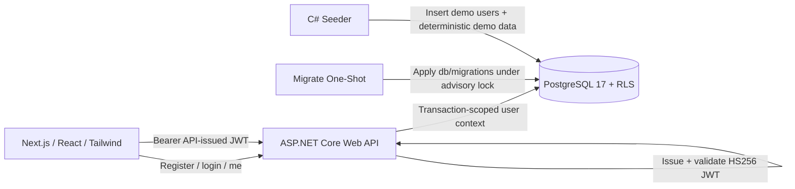

# Architecture

FieldLedger uses a small but production-shaped service architecture, fully self-contained in Docker Compose:

- `web`: Next.js/React/Tailwind frontend.
- `api`: ASP.NET Core Web API — owns first-party auth and all business operations.
- `db`: PostgreSQL 17 container with RLS enabled and forced on tenant tables.
- `migrate`: one-shot service (seeder binary in `migrate` mode) that applies `db/migrations/*.sql`.
- `seeder`: C# console application for demo data (compose profile `tools`).

There are no external services: no hosted database, no external identity provider, no payment provider. See [ADR 0006](../adr/0006-self-contained-postgres-first-party-auth.md) and [ADR 0007](../adr/0007-in-app-plan-management-no-external-billing.md).

See [architecture.mmd](../diagrams/architecture.mmd).

## Runtime topology

## Service responsibilities

### Web

The frontend handles the user experience only. It does not make authorization decisions.

Responsibilities:

- Login/register against the API's first-party auth endpoints.
- Store the access token in local session state (`localStorage` + memory; accepted portfolio-v1 tradeoff).
- Call API with `Authorization: Bearer <access_token>`; on `401`, clear the session and route to `/login`.
- Render org dashboard, field detail, insights, season reports, members, and the plan page.
- Refetch plan state after upgrade/downgrade mutations resolve (no polling needed).
- Hide unavailable UI operations for a better UX.

### API

The API is the identity boundary and the business boundary.

Responsibilities:

- Own email/password auth: `POST /api/auth/register`, `POST /api/auth/login`, `GET /api/auth/me`.
- Hash passwords with PBKDF2 (ASP.NET Core `PasswordHasher`).
- Issue and validate its own HS256 JWTs (`AUTH_JWT_SECRET`, issuer `fieldledger-api`, audience `fieldledger`).
- Extract the trusted subject/user ID from validated tokens.
- Open a Postgres transaction per request; `set local role authenticated` and `set_config('app.user_id', , true)` so RLS sees the verified user.
- Execute queries as `fieldledger_api`, a role without `BYPASSRLS`.
- Enforce server-side entitlements, including the owner-only plan upgrade/downgrade path via `app.set_org_plan`.
- Generate CSV exports and season reports (Pro-gated).

See [PostgreSQL and RLS](../docs/source-map.md#postgresql-and-rls) and [ASP.NET Core](../docs/source-map.md#aspnet-core) docs.

### PostgreSQL (`db`)

The database is the final authorization boundary.

Responsibilities:

- Store identity (first-party `users` table) and tenant data.
- Enforce RLS policies keyed on `app.current_user_id()` reading `app.user_id`.
- Enforce Free-plan field limits with DB-side guardrails (trigger).
- Store entitlement state and the `plan_changes` audit trail; direct writes are restricted to the `security definer` plan-change function.
- Bootstrap roles from `db/init/01-roles.sql` on first container start.
- Support read-model queries for dashboards and insights.

### Migrate

The `migrate` service is a one-shot run of the seeder binary in `migrate` mode.

Responsibilities:

- Wait for the `db` healthcheck, then apply `db/migrations/*.sql` in filename order.
- Take a pg advisory lock so concurrent runs are safe.
- Record each applied file in `schema_migrations`.
- Exit successfully so `api` (which `depends_on` it with `service_completed_successfully`) can start.

### Seeder

The seeder creates a repeatable demo state, connecting directly to Postgres with the migrator role (`DATABASE_ADMIN_URL`).

Responsibilities:

- Create the three demo users with PBKDF2 hashes compatible with the API's `PasswordHasher`.
- Create two organizations.
- Assign owner/agronomist/viewer memberships.
- Generate three years of deterministic field/season/activity data.
- Be idempotent via the `seed_runs` marker (`--force` to reseed).

## Trust boundaries

| Boundary | Trusted? | Notes |
|---|---:|---|
| Browser | No | May hold JWT; never trusted for role or plan state. |
| API-issued JWT | Conditionally | Trusted only after API validation (signature, issuer, audience, lifetime). |
| API | Yes | Authenticates user, executes business workflows. |
| Postgres RLS | Yes | Final tenant and role enforcement layer. |
| Migrate | Dev-only trusted | Runs as `fieldledger_migrator`, the schema owner. |
| Seeder | Dev-only trusted | Uses the elevated migrator connection locally. |

## Key architectural rule

Normal user data access must never use a `BYPASSRLS` role, a table-owner connection, or the migrator connection string. Elevated credentials (`DATABASE_ADMIN_URL`, `fieldledger_migrator`) are restricted to the `migrate` service and the seeder; user traffic always flows through `fieldledger_api` with transaction-scoped user context.
